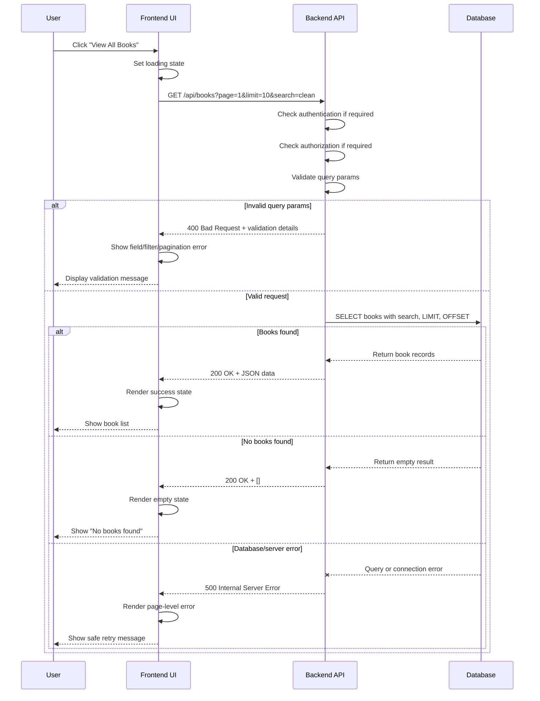

# Week 01 - Full-stack Request Flow

## Theme

Understand how a full-stack application works from client to server: web/mobile client -> API -> backend logic -> database -> response -> UI update.

## Dates

2026-05-04 to 2026-05-10

## Goals

- Explain the request/response lifecycle for both web and mobile clients.
- Connect HTTP methods, status codes, API validation, backend logic, and database reads/writes.
- Build a basic request-flow diagram that can be reused in interviews and project READMEs.
- Add at least 3 interview-ready questions across frontend, backend/API, and database notes.
- Produce small GitHub evidence through notes, a diagram, and commits.

## Planned Outputs

- Request-flow diagram in this weekly log or `assets/diagrams/`.
- Updated notes in:
  - `interview-prep/frontend.md`
  - `interview-prep/backend-api.md`
  - `interview-prep/database.md`
- 3-5 interview questions with short answer frameworks.
- Weekly review and CV/portfolio check.

## Daily Plan

| Date | Focus | Output |
| --- | --- | --- |
| Mon 2026-05-04 | Full-stack flow concept | Write the first explanation of browser/mobile -> API -> backend -> database -> response |
| Tue 2026-05-05 | Mini API example | Describe one example request such as `GET /api/books` or `POST /api/login` with request, validation, and response |
| Wed 2026-05-06 | Light review | Add 1 frontend interview question about URL/request flow |
| Thu 2026-05-07 | Light review | Add 1 backend/API interview question about status codes, validation, or error responses |
| Fri 2026-05-08 | Deep work | Create or refine the request-flow diagram and connect it to database reads/writes |
| Sat 2026-05-09 | Cleanup | Refactor notes, improve diagram labels, and commit progress |
| Sun 2026-05-10 | Review | Complete Week 01 log, check CV backlog, and prepare Week 02 plan |

## What I Learned

- Frontend responsibility: collect user actions/input, send HTTP requests, and render loading, success, empty, error, auth, permission, and validation states.
- Backend responsibility: receive the HTTP request, check authentication/authorization if required, validate request data, run business logic, query the database, and return a safe status code plus JSON response.
- Database responsibility: store data, execute backend queries, and return query results to the backend.
- Backend validation must happen before querying the database. Invalid query parameters, path parameters, or request bodies should return `400 Bad Request`.
- List/search endpoints with no matching records should return `200 OK` with an empty array, while missing specific resources should return `404 Not Found`.
- Pagination uses `page`, `limit`, `offset = (page - 1) * limit`, `total`, and `totalPages = Math.ceil(total / limit)`, with `totalPages = 0` when `total = 0`.

## What I Practiced

- Explained the `GET /api/books` request flow from user click to UI update.
- Practiced status code decisions for `200`, `201`, `204`, `400`, `401`, `403`, `404`, and `500`.
- Practiced frontend state decisions for loading, success, empty, field/control validation errors, auth state, permission error, and page-level error.
- Designed a detailed sequence diagram with happy path, invalid query, empty result, and database/server error branches.

## Detailed Request-flow Diagram

## Interview Questions Added

1. What happens from the moment a user clicks a button until the UI updates with API data?
2. How should a backend API handle validation errors versus unexpected server errors?
3. How does a backend use a database result to build a safe API response?
4. Why should backend validation happen before database queries?
5. Why should `GET /api/books?search=unknown` return `200 OK` with `[]` instead of `404 Not Found`?
6. How should the frontend handle loading, success, empty, validation, auth, permission, network, and server error states?
7. How do `page`, `limit`, `offset`, `total`, and `totalPages` work in pagination?

## Done Checklist

- [x] Request-flow explanation written
- [x] Basic diagram completed
- [x] Frontend notes updated
- [x] Backend/API notes updated
- [x] Database notes updated
- [x] At least 3 interview questions added
- [ ] At least 2 meaningful commits made
- [ ] CV/portfolio check completed
- [ ] Week 02 plan drafted
